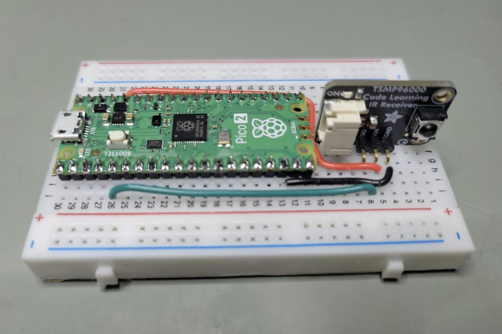

# PCjr Keyboard to USB Adapter

This is a small, inexpensive adapter that will allow you to use a wireless PCjr keyboard on a modern PC.

There are two versions of this project. Click for more information on each.

- the initial prototype, utilizing on Arduino Giga: [arduino_jr_kbd](arduino_jr_kbd/)
- the final version, utilizing a Pi Pico 2: [pico_jr_kbd](pico_jr_kbd/)
