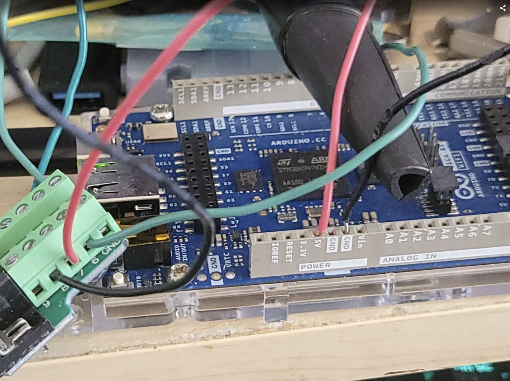

# Arduino PCjr Keyboard Bridge

This was the original prototype of the PCjr keyboard bridge, using an Arduino Giga. This is not cost-effective, but I just had a Giga lying around, so its what I used. For a photo-sensor, I used a Commodore 64 light pen. No, really!

The INO file here can be used with Arduino IDE. It is just provided for reference, it is not supported in any way.

