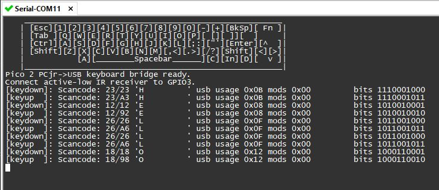

# PCjr Keyboard to USB Adapter

This is a small, inexpensive adapter that will allow you to use a wireless PCjr keyboard on a modern PC.

Designed for a Pi Pico 2 and [Adafruit TSMP96000 breakout board](https://www.adafruit.com/product/5970).

## Assemble Breadboard:


Wire TSMP96000's VIN to Pico's 3.3V, GND to GND, SIG to GPIO 3.

## Build Firmware:

### cmake
```
cmake -S . -B build -DPICO_BOARD=pico2
cmake --build build
```

### Visual Studio Code

 - Install the official Pico extension for VSC.
 - Click the Pico icon on the left toolbar
 - Click 'import project' - a new Visual Studio window will open.
 - Click 'compile project'

### All

The UF2 will be written under `build`. Reconnect your Pico 2 while holding BOOTSEL, then drag the file to the Pi. It will reboot, and then you're good to go!

## Serial Monitor

You can connect to the Pico 2's serial port with a terminal emulator to view a debug display. This will show a visualization of the keyboard state at the top of the screen, with keys the Pico thinks are pressed indicated in blue. Log messages of successful decoding events or errors will be printed below that.



## Notes

> [!WARNING]  
> The PCjr keyboard IR protocol uses a 40kHz carrier. This frequency overlaps the operating ballast frequency of many CFL bulbs.
> Avoid the use of CFL bulbs in areas you wish to use the PCjr keyboard.

