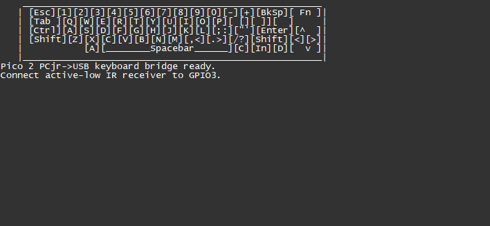

# PCjr Keyboard to USB Adapter

This is a small, inexpensive adapter that will allow you to use a wireless PCjr keyboard on a modern PC.

Designed for a Pi Pico 2 and [Adafruit TSMP96000 breakout board](https://www.adafruit.com/product/5970).

## Assembling the Breadboard


Wire TSMP96000's VIN to Pico's 3.3V, GND to GND, SIG to GPIO 3.

## Building the Firmware

### cmake

First, have the Pico SDK installed and able to build projects. If you don't know how to do that, see the Visual Studio Code option, it's easier and handles everything for you.

```
cmake -S . -B build -DPICO_BOARD=pico2
cmake --build build
```

### Visual Studio Code

 - Install the official Pico extension for VSC.
 - Click the Pico icon on the left toolbar
 - Click 'import project' - a new Visual Studio window will open.
 - Click 'compile project'

### All

The UF2 will be written under `build`. Reconnect your Pico 2 while holding the `BOOTSEL` button down. The Pico will then mount a volume. Copy the UF2 file to the Pico. The Pico will then reboot, and then you're good to go!

## Serial Monitor

You can connect to the Pico 2's serial port with a terminal emulator to view a debug display. This will show a visualization of the keyboard state at the top of the screen, with keys the Pico thinks are pressed indicated in blue. Log messages of successful decoding events or errors will be printed below that.



The serial monitor will discard any keystrokes it receives, so it is safe to leave the window focused while testing.

## Function Key

By default the PCjr's `Function` key, if not triggering a PCjr scancode conversion, will map to the USB `GUI` key. This maps to the `Windows` key in Windows, or the `Command (⌘)` key in MacOS. You can disable the define `PCJR_FUNCTION_USB_LOGO_FALLBACK` if you don't want the `Function` key to do this.

## Stuck Key Detection

One of the biggest issues with using an IR keyboard is missing key-up scancodes, which leads to stuck keys, which can be very frustrating. One can clear a stuck key condition by pressing the affected key again, but a way to automatically clear stuck keys would be convenient.

The PCjr keyboard has 'typematic' action - when a key is held down, after 500ms it begins to repeat. This means if the Pico thinks a key is held down, it should expect to repeatedly receive new key-down events for that key. If it does not, that key must have been released at some point, or the keyboard is not pointing at the receiver, or has caught on fire. In any case, the key is safe to release to the OS. Only one stuck key can be detected in this manner, so it is of limited usefulness. 

## Synthetic Key-Up Support

If you are in a challenging IR environment, like in the presence of CFL bulbs or very bright sunlight, then you may want the Pico to send key-up scancodes on behalf of the keyboard. This is called **tap mode** and can be enabled by defining `PCJR_SEND_SYNTHETIC_KEYUPS` as `1`.  If you want to be able to hold keys down, which is required to play most video games, then you do not want to enable this option. 

## Notes

> [!WARNING]  
> The PCjr keyboard IR protocol uses a 40kHz carrier. This frequency overlaps the operating ballast frequency of many CFL bulbs.
> Avoid the use of CFL bulbs in areas you wish to use the PCjr keyboard.

